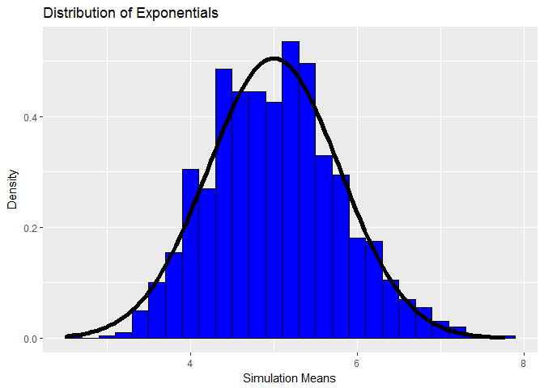

# Demonstration Of Central Limit Theorem Using Exponential Distribution
Yash Kumar Singh  


## Overview

The purpose of this analysis is to investigate the exponential distribution and compare the same to the Central Limit Theorem.The parameter(i.e., lambda) will be set to 0.2 for all the simulations. This analysis will compare the distribution of averages of 40 exponentials. 

## Simulations

Setting seed and parameter values first, this code generates a distribution of averages of 40 exponentials for 1000 simulations.


```r
set.seed(143)
lambda <- 0.2
nexp <- 40

average <- NULL
for(i in 1:1000)
    average <- c(average, mean(rexp(nexp, lambda)))
```

## Sample Mean versus Theoretical Mean 

Theoretical mean of distribution


```r
lambda ^ -1
```

```
## [1] 5
```

Sample mean of distribution 


```r
mean(average)
```

```
## [1] 5.017549
```

Both the theoretical as well as sample mean are approximately same with a very small difference between them.

## Sample Variance versus Theoretical Variance

Theoretical variance of distribution


```r
(lambda * sqrt(nexp)) ^ -2
```

```
## [1] 0.625
```

Sample variance of distribution 


```r
var(average)
```

```
## [1] 0.6070057
```

Again it can be seen that both the theoretical as well as sample variance are approximately same with a very small difference between them.

## Distribution

Given below is the density histogram of the 1000 simulations. Added over the same plot is the normal distribution with mean (lambda ^ -1) and variance of ((lambda*sqrt(nexp)) ^ -2) which are the theoretical parameter values for the normal distribution occuring due to the simulations.


```r
library(ggplot2)
g <- ggplot(data.frame(column = average), aes(x = column))
g <- g + geom_histogram(aes(y = ..density..), binwidth = 0.2, fill = 'blue', color = 'black')
g <- g + stat_function(fun = dnorm, args = list(mean = lambda^-1, sd=(lambda*sqrt(nexp))^-1), size=2)
g <- g + labs(title = "Distribution of Exponentials", x = "Simulation Means", y = "Density")
g
```

<!-- -->

As from the plot it can be seen that the normal density distribution overlayed onto the density histograms fits perfectly and hence shows that the distribution of averages of a large sample of exponentials is indeed normal. 

