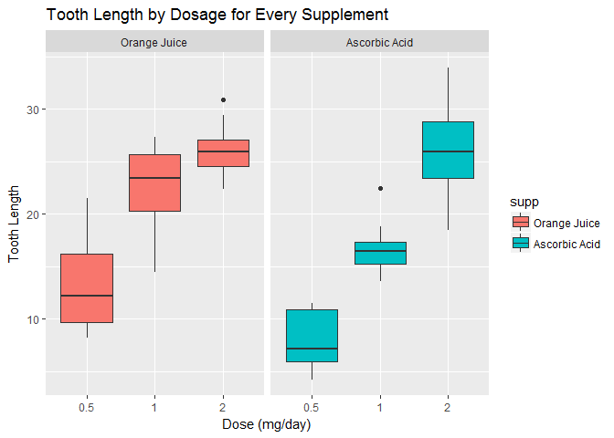

# Effect of Vitamin C on Tooth Growth in Guinea Pigs
Yash Kumar Singh  


## Overview

The purpose of this analysis is to load the 'ToothGrowth'data set from the datasets package in R, use the same to first perform an exploratory analysis and then use confidence intervals and hypothesis tests to compare tooth growth by supp and dose. 

## Exploratory Analysis

First we load the ToothGrowth dataset and use str and summary functions to gather basic summary about the dataset. 


```r
library(datasets)
library(ggplot2)
str(ToothGrowth)
```

```
## 'data.frame':	60 obs. of  3 variables:
##  $ len : num  4.2 11.5 7.3 5.8 6.4 10 11.2 11.2 5.2 7 ...
##  $ supp: Factor w/ 2 levels "OJ","VC": 2 2 2 2 2 2 2 2 2 2 ...
##  $ dose: num  0.5 0.5 0.5 0.5 0.5 0.5 0.5 0.5 0.5 0.5 ...
```

```r
summary(ToothGrowth)
```

```
##       len        supp         dose      
##  Min.   : 4.20   OJ:30   Min.   :0.500  
##  1st Qu.:13.07   VC:30   1st Qu.:0.500  
##  Median :19.25           Median :1.000  
##  Mean   :18.81           Mean   :1.167  
##  3rd Qu.:25.27           3rd Qu.:2.000  
##  Max.   :33.90           Max.   :2.000
```

Next we draw a box plot to compare both the supplements across different dosages to see which one is better for tooth growth.


```r
data <- ToothGrowth
levels(data$supp) <- c("Orange Juice", "Ascorbic Acid")
g <- ggplot(data, aes(x = factor(dose), y = len))
g <- g + facet_grid(.~supp)
g <- g + geom_boxplot(aes(fill = supp))
g <- g + labs(title = "Tooth Length by Dosage for Every Supplement")
g <- g + labs(x = "Dose (mg/day)", y = "Tooth Length")
print(g)
```

<!-- -->

As can be inferred from the plot, Orange Juice shows better tooth lengths for 0.5 and 1 mg/day dosages whereas for 2 mg/day lengths for both are similar.

## Assumptions

For the further analysis we assume that the ToothGrowth data follows normal distribution and also no other factors affect tooth growth other than dose and supp.

## Hypothesis Tests

We would test three different hypothesis stating for a dose of x mg/day both supp deliver same growth. 

For x = 0.5 mg/day


```r
h0.5 <- t.test(len ~ supp, data = subset(data, dose == 0.5))
h0.5$conf.int
```

```
## [1] 1.719057 8.780943
## attr(,"conf.level")
## [1] 0.95
```

```r
h0.5$p.value
```

```
## [1] 0.006358607
```

As p-value is smaller than the significance level of 0.05, null hypothesis can be rejected and hence we infer that Orange Juice and Ascorbic acid do not have the same effect on tooth growth and Orange Juice delivers more tooth growth.

For x = 1 mg/day


```r
h1 <- t.test(len ~ supp, data = subset(data, dose == 1))
h1$conf.int
```

```
## [1] 2.802148 9.057852
## attr(,"conf.level")
## [1] 0.95
```

```r
h1$p.value
```

```
## [1] 0.001038376
```

As p-value is smaller than the significance level of 0.05, null hypothesis can be rejected and hence we infer that Orange Juice and Ascorbic acid do not have the same effect on tooth growth and Orange Juice delivers more tooth growth.

For x = 2 mg/day


```r
h2 <- t.test(len ~ supp, data = subset(data, dose == 2))
h2$conf.int
```

```
## [1] -3.79807  3.63807
## attr(,"conf.level")
## [1] 0.95
```

```r
h2$p.value
```

```
## [1] 0.9638516
```

As p-value is larger than the significance level of 0.05, null hypothesis can't be rejected and hence we infer that Orange Juice and Ascorbic acid have the same effect on tooth growth.

## Conclusions

From the abve 3 tests we can't conclude as a whole that Orange Juice is better than Ascorbic Acid for tooth growth in guinea pigs. However Orange Juice is certainly found better in doses of 0.5 and 1 mg/day as compared to Ascorbic Acid. Also the results align with the exploratory boxplot that we saw earlier. 

